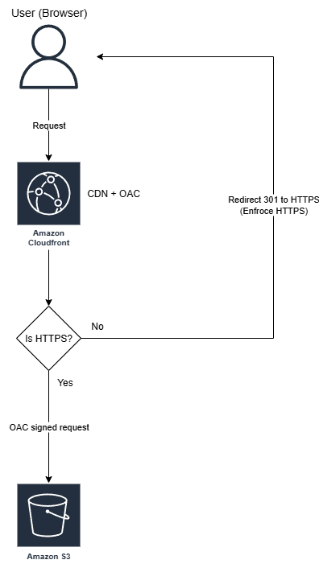
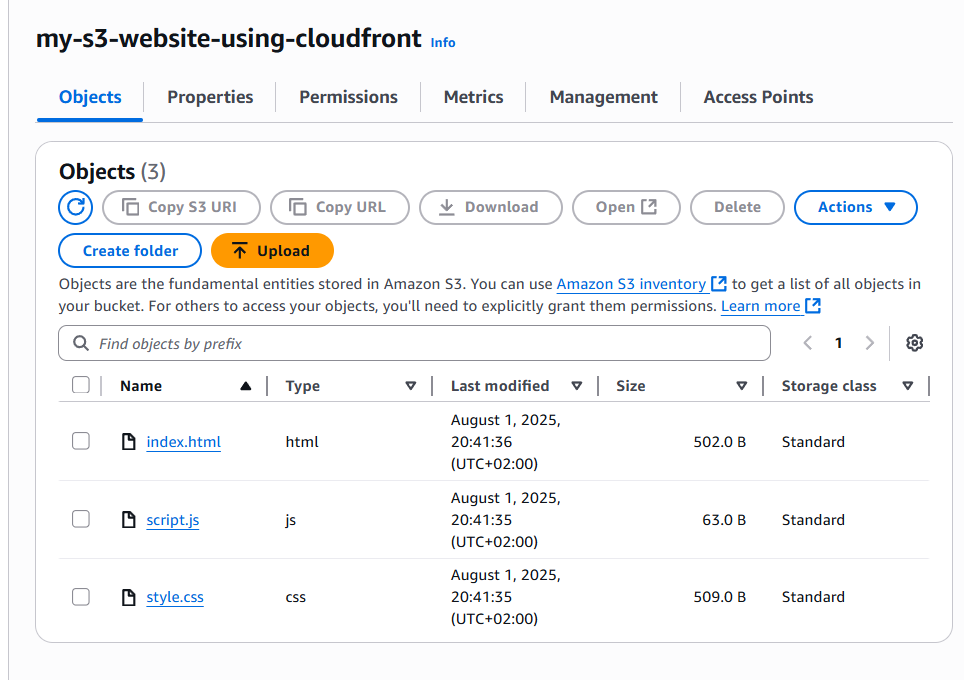
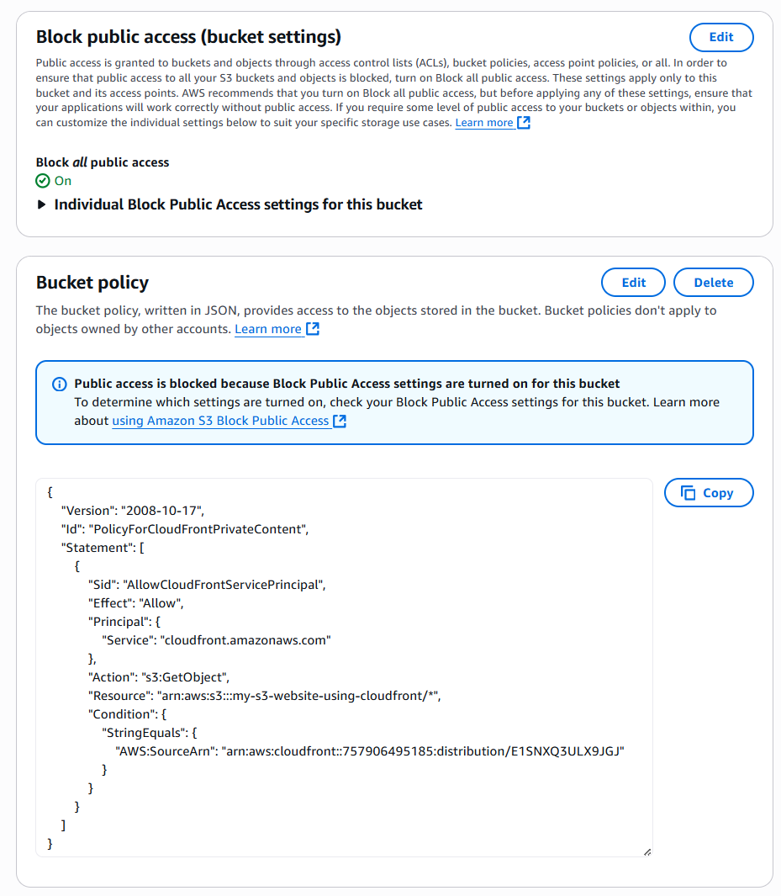
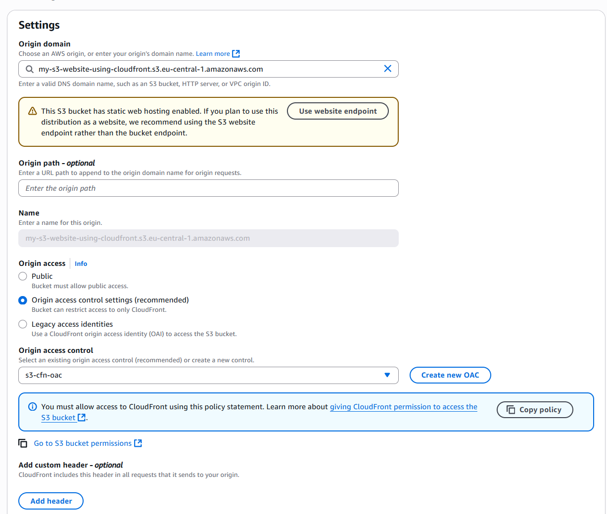
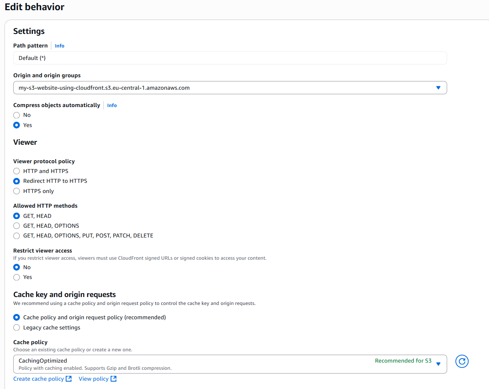
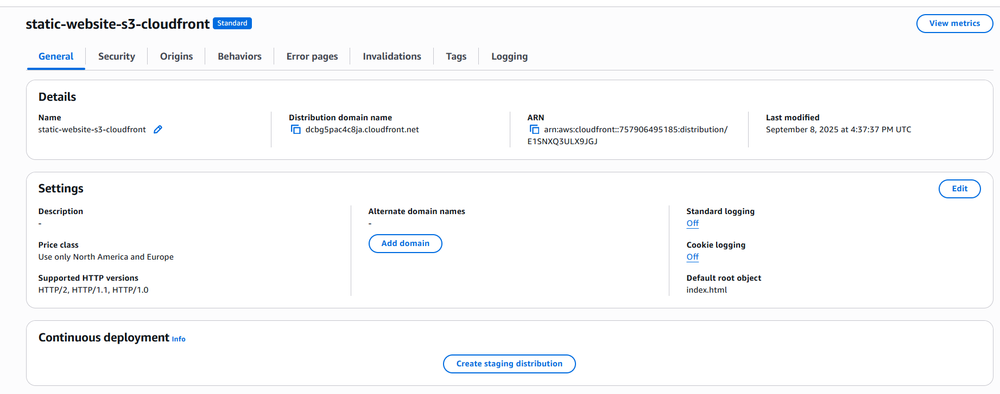
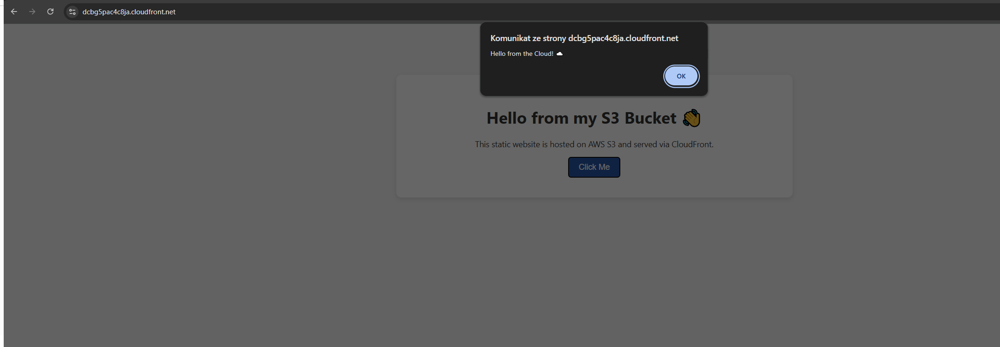

# Static Website on S3 + CloudFront (with OAC)

## 📌 Overview
This project demonstrates hosting a static website using **Amazon S3** and serving it securely through **Amazon CloudFront**.  
The setup uses **Origin Access Control (OAC)** to keep the S3 bucket private and enforce **HTTPS-only traffic**.

---

## 🏗 Architecture

**Flow:**
1. User connects via CloudFront.  
2. CloudFront enforces HTTPS (redirects HTTP → HTTPS).  
3. CloudFront uses OAC to fetch content from a private S3 bucket.  
4. S3 hosts static files (HTML, CSS, JS) with **Block Public Access** enabled.  

---

## 🚀 Implementation

### 1. S3 Bucket
- Bucket created with **Block Public Access enabled**.  
- Static files uploaded:  
  - `index.html`  
  - `style.css`  
  - `script.js`  

---

### 2. Bucket Policy
Bucket is private. Access is only allowed to CloudFront distribution via OAC.

---

### 3. CloudFront Distribution
#### Origin
- Connected to S3 bucket (REST endpoint) with OAC.  

#### Behavior
- Redirect HTTP → HTTPS.  
- Optimized caching (recommended for S3).  

#### General Settings
- Default root object = `index.html`.  

---

### 4. Website Access
The website is available securely via CloudFront domain:  
👉 `https://dcbg5pac4c8ja.cloudfront.net`

---

## 🔐 Security & Best Practices
- ✅ **OAC** used → S3 bucket is fully private.  
- ✅ **Block Public Access** enabled for S3.  
- ✅ **Redirect HTTP → HTTPS** for secure in-transit communication.  
- ✅ **Default root object** ensures predictable entry point.  
- 💡 In production, custom domain + ACM TLS cert could be added.  

---

## 📚 Lessons Learned
- Difference between **S3 website endpoint** vs **REST endpoint**.  
- How to configure **OAC** instead of legacy OAI.  
- How CloudFront enforces **HTTPS-only access**.  
